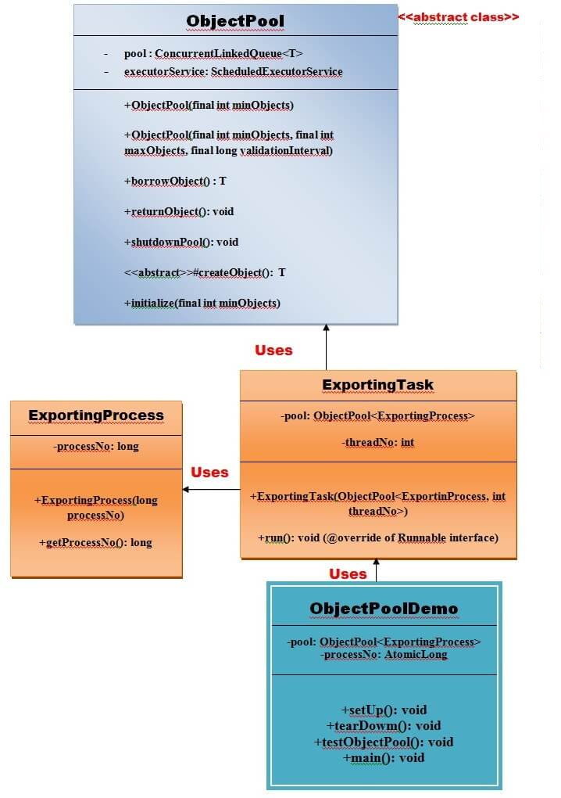
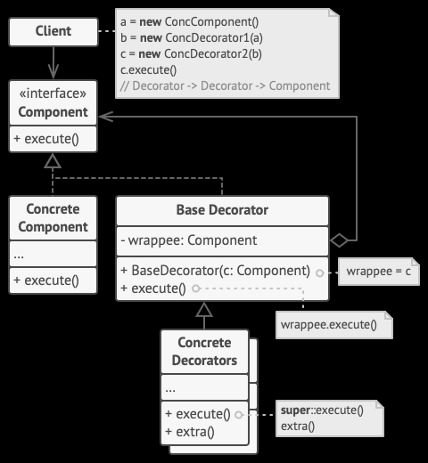
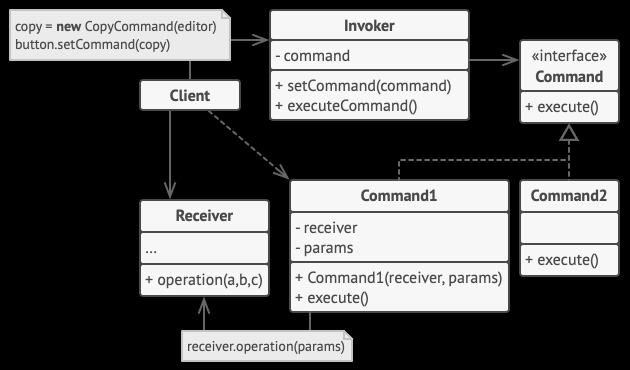

# Design pattern examples
A project to become familiar with all the different design patterns in Java.

For each design pattern category, I have chosen a different source. (See sources for the ones I used).  

---
## Patterns

---
### Creational patterns
#### Factory pattern

---
#### Abstract factory pattern

---
#### Singleton Pattern

---
#### Prototype Pattern

---
#### Builder Pattern

---
#### Object pool Pattern

---
### Structural patterns

---
#### Adapter pattern

---
#### Bridge pattern

---
#### Composite pattern

---
#### Decorator pattern

---
#### Facade pattern

---
#### Flyweight pattern

---
#### Proxy pattern

---
### Behavioural patterns

---
#### Chain of responsibility

---
#### Command pattern

---
#### Interpreter pattern

---
#### Iterator pattern

---
#### Observer pattern
What Is the Observer Pattern?
Observer is a behavioral design pattern. It specifies communication between objects: observable and observers. An observable is an object which notifies observers about the changes in its state.

For example, a news agency can notify channels when it receives news. Receiving news is what changes the state of the news agency, and it causes the channels to be notified.

Let's see how we can implement it ourselves.

- [The Observer Pattern in Java](https://www.baeldung.com/java-observer-pattern)

---
### Behavioural patterns

---
#### Combinator pattern

---
#### Borrower pattern

---

## Sources
- [Design Patterns in Java](https://www.javatpoint.com/design-patterns-in-java)
- [DESIGN PATTERNS Refactoring Guru](https://refactoring.guru/design-patterns)
- [Source making: Design patterns](https://sourcemaking.com/design_patterns/behavioral_patterns)
- [Combinator/composition pattern](https://java-design-patterns.com/patterns/combinator/)
- [Design Patterns in the Light of Lambda Expressions. Venkat Subramaniam, Agile developer, inc](https://www.youtube.com/watch?v=WN9kgdSVhDo)
