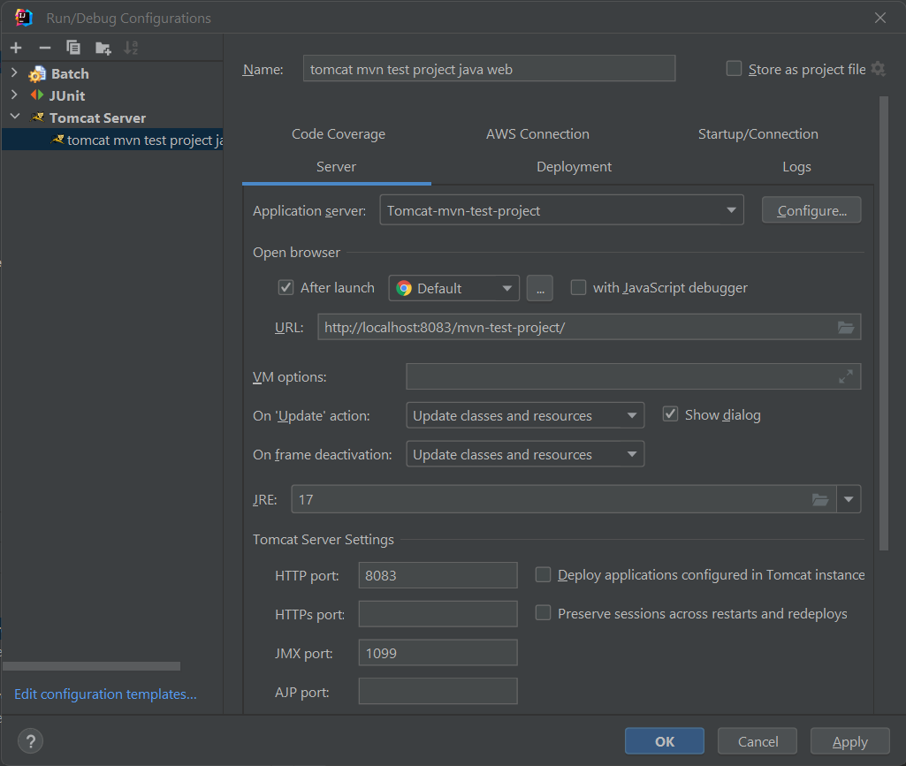

## Java web samples

---

This module was made to explore java web capabilities.

Among them how the apache servlet filter can be used

Also, how jsp works

---

### Simple webserver

to start a simple java webserver, run

[start-jwebserver](start-jwebserver.cmd)

or run

```shell
C:\PROGRA~1\Java\jdk-19\bin\jwebserver
```

The simple webserver automatically renders html pages. jsp pages are no automatically rendered

---

### Configuring tomcat

To be able to serve the app by tomcat, it must be packages as a war. this is stated in the [pom.xml](pom.xml)



After tomcat startup, the project is available [here](http://localhost:8083/mvn-test-project/)

---

### Java server pages (jsp)

[A Guide to the JavaServer Pages Tag Library (JSTL)](https://www.baeldung.com/jstl)

---

## Sources

- [Documentation Tomcat Servlet filter](https://tomcat.apache.org/tomcat-5.5-doc/servletapi/javax/servlet/Filter.html)

---
