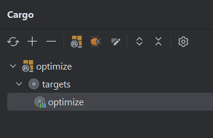

# java-rust-jni

---

A few examples on how to call rust from java

- Small example on how to use jbyteArray in rust.
- Hello world from rust

---

## Generating the header file

run the following command from the directory where your java file is:

`javac -h . <java-file-name>.java`

---

## Run the app

- Attach Cargo.toml to `optimize` and `mylib`
- Build optimize.dll

- Run the main method in one of the samples

---

## Sources

- [Crate jni](https://docs.rs/jni/latest/jni/)
- [repo](https://github.com/kalaspuffar/java-rust-jni)
- [Using rust jni to call an external rust library in java](https://www.youtube.com/watch?v=VIZK14pnGcw)
- [Java Programming Tutorial
  Java Native Interface (JNI)](https://www3.ntu.edu.sg/home/ehchua/programming/java/javanativeinterface.html)
- [Java Native Interface | Guide to JNI | What is JNI? | Geekific](https://www.youtube.com/watch?v=N7ViTwn682k)

---
